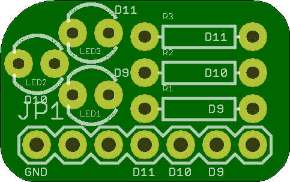

## Mini_Arduino_3mm 

### Board dimensions

* (80000, 50000) original units
* (0.8000, 0.5000) inches
* (20.3200, 12.7000) mm

[gerbers](Mini_Arduino_3mm_gerber.zip?raw=true)

| Front | Back |
| --- | --- |
|  |  |

## Mini_Arduino_4mm_Oval 

### Board dimensions

* (80000, 50000) original units
* (0.8000, 0.5000) inches
* (20.3200, 12.7000) mm

[gerbers](Mini_Arduino_4mm_Oval_gerber.zip?raw=true)

| Front | Back |
| --- | --- |
|  |  |

## Mini_Arduino_5mm 

### Board dimensions

* (90000, 66246) original units
* (0.9000, 0.6625) inches
* (22.8600, 16.8265) mm

[gerbers](Mini_Arduino_5mm_gerber.zip?raw=true)

| Front | Back |
| --- | --- |
|  |  |

## Mini_Arduino_5mm_RGB 

### Board dimensions

* (80000, 50000) original units
* (0.8000, 0.5000) inches
* (20.3200, 12.7000) mm

[gerbers](Mini_Arduino_5mm_RGB_gerber.zip?raw=true)

| Front | Back |
| --- | --- |
|  |  |

## Mini_Oval 

### Board dimensions

* (65000, 60000) original units
* (0.6500, 0.6000) inches
* (16.5100, 15.2400) mm

[gerbers](Mini_Oval_gerber.zip?raw=true)

| Front | Back |
| --- | --- |
|  |  |

## Mini_RGB 

### Board dimensions

* (60000, 60000) original units
* (0.6000, 0.6000) inches
* (15.2400, 15.2400) mm

[gerbers](Mini_RGB_gerber.zip?raw=true)

| Front | Back |
| --- | --- |
|  |  |

